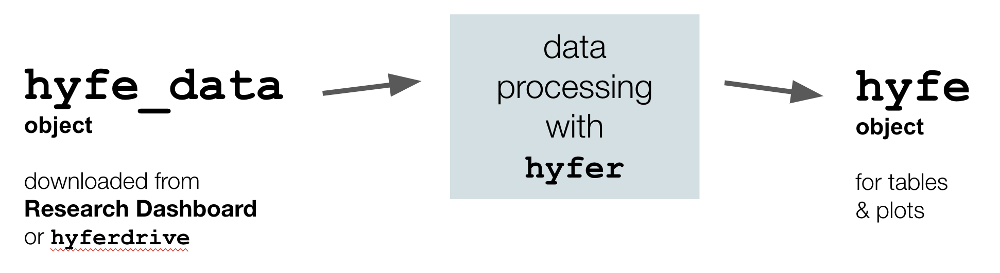

```{r, include = FALSE}
knitr::opts_chunk$set(
  collapse = TRUE,
  comment = "#>"
)
```

&nbsp;  

The `hyfer` package provides utilities for interacting with data collected by Hyfe cough detection apps ([www.hyfe.ai](www.hyfe.ai)). This package was designed to be used by Hyfe analysts and external research partners alike.   


## `hyfer` in a nutshell 

Put simply, `hyfer` processes raw Hyfe data -- which you downloaded in a standard format referred to as a **`hyfe_data`** object -- into a polished format for tables and plots. We refer to that post-processed, analysis-ready data as a **`hyfe`** object.  

&nbsp;  
<center>
{width=70%}
</center>
&nbsp;  

The following chunk of code shows you the whole game; use it as a template for starting your own analysis. The rest of the vignette explains each bit of this code, demonstrates other `hyfer` functions, and provides plot examples. 

```{r, echo=TRUE, eval=FALSE, include=TRUE, collapse=TRUE, warning=FALSE, message=FALSE}
# Install hyfer
library(devtools) 
devtools::install_github('hyfe-ai/hyfer', force=TRUE, quiet=TRUE)
library(hyfer)

# Other dependencies
library(dplyr)
library(lubridate)
library(ggplot2)

# Bring in your hyfe_data object (here we use sample data)
data(hyfe_data)

# Process data for all users together
ho <- process_hyfe_data(hyfe_data)

# ... or process users separately
ho_by_user <- process_hyfe_data(hyfe_data, by_user = TRUE)

# summarize data
hyfe_summarize(ho_by_user)

# Now ready for plotting, etc. 
```


## Setup

### Install `hyfer`

```{r, echo=FALSE, eval=FALSE, include=FALSE, collapse=TRUE, warning=FALSE, message=FALSE}
# optional code for local fast load -- not included in vignette
library(dplyr)
library(devtools) 
document() 
load_all()
```

The `hyfer` package is maintained on `GitHub` and can be installed as follows: 

```{r, echo=TRUE, eval=TRUE, collapse=TRUE, warning=FALSE, message=FALSE}
library(devtools) 
devtools::install_github('hyfe-ai/hyfer', quiet=TRUE)
library(hyfer)
```

Hyfe data have been formatted for use with the `tidyverse` of packages, particularly `dplyr`, `lubridate`, and `ggplot2`. 

```{r, echo=TRUE, eval=TRUE, collapse=TRUE, warning=FALSE, message=FALSE}
library(dplyr)
library(lubridate)
library(ggplot2)
```

### Getting Hyfe data 

This package assumes (1) you already have some Hyfe data locally on your computer, and (2) those data are structured in a standardized way, as a **`hyfe_data` object** *(see next section)*.  

Hyfe's research collaborators can download data for their respective research cohorts from the [Hyfe Research Dashboard](https://dashboard.hyfe.ai/). Hyfe's internal analysts download data directly using `hyferdrive`, a private company package.  

Both the dashboard and `hyferdrive` deliver data structured in exactly the same way, allowing both groups to utilize the functions offered in `hyfer`.  

To get started in `hyfer`, begin by using a sample dataset that comes built-in to the package:  

```{r, echo=TRUE, eval=TRUE, collapse=TRUE, warning=FALSE, message=FALSE}
data(hyfe_data)
```

This sample dataset contains Hyfe data for two "super-users" of the [Hyfe Cough Tracker app](https://www.hyfeapp.com/).  


### Structure of a `hyfe_data` object

All downloaded Hyfe data are provided in a standardized data format: a `hyfe_data` object. A `hyfe_data` object is simply a list with 6 standard slots. 

```{r, echo=TRUE, eval=TRUE, collapse=TRUE, warning=FALSE, message=FALSE}
names(hyfe_data)
```

A detailed description of each slot is provided below.  


#### `hyfe_data$id_key`  

The `id_key` slot provides the unique identifiers for each user represented in the data.  

```{r, echo=TRUE, eval=TRUE, collapse=TRUE, warning=FALSE, message=FALSE}
hyfe_data$id_key %>% head()
```

```{r, echo=FALSE, eval=FALSE, collapse=TRUE, warning=FALSE, message=FALSE}
Most researchers interact with identifiers in the `email` and `alias` columns, but the most important column in this dataframe is the `uid`. The `uid` is the key index for attaching Hyfe data to a specific user. Every other data slot in the `hyfe_data` object has a `uid` column.  
```


#### `hyfe_data$sessions`  

The `sessions` slot provides details for each session of user activity for all users in the data.  

```{r, echo=TRUE, eval=TRUE, collapse=TRUE, warning=FALSE, message=FALSE}
hyfe_data$sessions %>% names()

hyfe_data$sessions %>% head()
```

The `start` and `stop` times of each session of user activity are provided as numeric timestamps, as are all other date/time fields in the `hyfe_data` object. Though they are not easy to read, timestamps are an unambiguous and timezone-agnostic representation of date/time. Timestamps represent the seconds since midnight UTC on January 1, 1970. 


#### `hyfe_data$sounds`  

The `sounds` slot provides details for each explosive sound detected for all users in the data.  

```{r, echo=TRUE, eval=TRUE, collapse=TRUE, warning=FALSE, message=FALSE}
hyfe_data$sounds %>% names()

hyfe_data$sounds %>% head()
```

- The column `prediction_score` contains the probability that the explosive sound is a cough, based upon Hyfe's cough classification algorithms.   

- The column `is_cough` is a boolean (`TRUE` / `FALSE`) stating whether or not the prediction score is above Hyfe's cough prediction threshold of 0.85.  

- The column `onboarding_cough` is a boolean stating whether or not this sound was collected while the user was onboarding (following instructions upon log in to cough into the app). Since these are elicited coughs, in certain analyses it may be useful to ignore coughs for which `onboarding_cough == TRUE`.  


#### `hyfe_data$locations`  

The `locations` slot provides details for each location fix for all users in the data. 

```{r, echo=TRUE, eval=TRUE, collapse=TRUE, warning=FALSE, message=FALSE}
hyfe_data$locations %>% names()

hyfe_data$locations %>% head()
```

Note that some studies, such as the one related to this sample data, have location data service disabled.  

#### `hyfe_data$labels`  

This slot is empty for now. It is a placeholder for a future time in which hyfe will have  manually labelled sounds from a dataset associated with it inside the `hyfe_data` object. 

#### `hyfe_data$cohort_settings`  

```{r, echo=TRUE, eval=TRUE, collapse=TRUE, warning=FALSE, message=FALSE}
hyfe_data$cohort_settings %>% names()

hyfe_data$cohort_settings
```

The `cohort_settings` slot will only be populated if the `hyfe_data` object is for a research cohort. Otherwise this slot will be `NULL`.  Critically, `cohort_settings` contains the timezone used to determine local time in the function `format_hyfe_time()`.  


## Processing Hyfe data

Once you download Hyfe data, the first step is to process it.  

```{r, echo=TRUE, eval=TRUE, collapse=TRUE, warning=FALSE, message=FALSE}
ho <- process_hyfe_data(hyfe_data,
                        verbose=TRUE)
```

This returns a standard `hyfe` object (`ho` for short variable names), a named list with the original `hyfe_data` slots plus new ones. These `hyfe` objects are formatted to make subsequent plots and analyses as simple as possible.  The standard `hyfe` object structure is explored in detail in the next session.  

By default, the `process_hyfe_data()` function lumps all user data together before summarizing, even if multiple users are present. To summarize each user separately, use the input `by_user`:  

```{r, echo=TRUE, eval=TRUE, collapse=TRUE, warning=FALSE, message=FALSE}
ho_by_user <- process_hyfe_data(hyfe_data,
                        by_user = TRUE,
                        verbose=TRUE)
```

If you want to work with data from only a single user in a `hyfe_data` object containing data from multiple users, use the function `filter_to_user()` before processing. Your workflow would look like: 

```{r, echo=TRUE, eval=FALSE, collapse=TRUE, warning=FALSE, message=FALSE}
# Look at your ID options
hyfe_data$id_key

# Filter data to the first ID in that list
hyfe_data_1 <- filter_to_user(uid = hyfe_data$id_key$uid[1],
                     hyfe_data)

# Now process the data into a hyfe object
ho <- process_hyfe_data(hyfe_data_1)
```

As explained above, the argument `uid` refers to the anonymous identifier assigns to each user.


### Structure of a `hyfe` object  

Once a `hyfe_data` object is processed, it becomes a `hyfe` object. The structure and formatting of the `hyfe` object is designed to accommodate plotting and analysis.  

```{r, echo=TRUE, eval=TRUE, collapse=TRUE, warning=FALSE, message=FALSE}
ho %>% names
```

The first several slots contain the raw data from the `hyfe_data` object, and those data are unchanged.  

The `coughs` slot has all explosive sounds classified as a cough, with various new date/time variables to streamline plotting and analysis.   

```{r, echo=TRUE, eval=TRUE, collapse=TRUE, warning=FALSE, message=FALSE}
ho$coughs %>% head
```

The `hours`, `days`, and `weeks` slots hold summary timetables of session activity, peak/cough detections, and cough rates for the entire dataset.  

```{r, echo=TRUE, eval=TRUE, collapse=TRUE, warning=FALSE, message=FALSE}
ho$hours %>% head
```

```{r, echo=TRUE, eval=TRUE, collapse=TRUE, warning=FALSE, message=FALSE}
ho$days %>% as.data.frame %>% head
```

```{r, echo=TRUE, eval=TRUE, collapse=TRUE, warning=FALSE, message=FALSE}
ho$weeks %>% as.data.frame %>% head
```

Note that when processed with `by_user = TRUE`, the slot names are slightly different:  

```{r, echo=TRUE, eval=TRUE, collapse=TRUE, warning=FALSE, message=FALSE}
ho_by_user %>% names
```

The `user_summaries` slot is itself a list; each of its slots pertains to a single user. Each user has a list of 4 tables: `hours`, `days`, `weeks`, and `id_key`.  

```{r, echo=TRUE, eval=TRUE, collapse=TRUE, warning=FALSE, message=FALSE}
# Data structure for first user 
ho_by_user$user_summaries[[1]] %>% names
```


## Visualizing Hyfe data  

Custom plotting functions are under construction. For now, `ggplot` works well with `hyfe` objects (see examples in Overview above.)

### Cumulative plots {#plots}

```{r, echo=TRUE, eval=TRUE, collapse=TRUE, warning=FALSE, message=FALSE, fig.width=6.5, fig.height=3}
plot_total(ho)
```

By default, `plot_total()` plots sessions. But you can specify for detections of explosive sounds ... 

```{r, echo=TRUE, eval=TRUE, collapse=TRUE, warning=FALSE, message=FALSE, fig.width=6.5, fig.height=3}
plot_total(ho, type='sounds')
```

... and of coughs: 

```{r, echo=TRUE, eval=TRUE, collapse=TRUE, warning=FALSE, message=FALSE, fig.width=6.5, fig.height=3}
plot_total(ho, type='coughs')
```

The default time unit for this function is `days`, but you can specify for `hours` ....

```{r, echo=TRUE, eval=TRUE, collapse=TRUE, warning=FALSE, message=FALSE, fig.width=6.5, fig.height=3}
plot_total(ho, type='coughs', unit='hours')
```

... and for `weeks` as well:  

```{r, echo=TRUE, eval=TRUE, collapse=TRUE, warning=FALSE, message=FALSE, fig.width=6.5, fig.height=3}
plot_total(ho, type='coughs', unit='weeks')
```

This function, like other `plot...()` functions in `hyfer`, allows you to return the dataset underlying the plot in addition to (or instead of) producing the plot. 

```{r, echo=TRUE, eval=TRUE, collapse=TRUE, warning=FALSE, message=FALSE, fig.width=6.5, fig.height=3}
plot_total(ho,
           unit='weeks', 
           type='coughs', 
           print_plot = FALSE, 
           return_data = TRUE)
```

This function also allows you to return the `ggplot` object so that you can add to it before printing the plot:  

```{r, echo=TRUE, eval=TRUE, collapse=TRUE, warning=FALSE, message=FALSE, fig.width=6.5, fig.height=3}
plot_total(ho, 
           unit='days',
           type='sessions',
           print_plot=FALSE, 
           return_plot=TRUE)$plot +
  ggplot2::labs(title='Monitoring time (person-days)')
```

These plot functions also accept `ho` objects that are processed with `by_user = TRUE`: 

```{r, echo=TRUE, eval=TRUE, collapse=TRUE, warning=FALSE, message=FALSE, fig.width=6.5, fig.height=3}
plot_total(ho_by_user,unit='hours', type='coughs')
```

Note that the users' individual datasets are pooled in order to make a single aggregate plot.  

But when using `ho_by_user`, you can also plot each user separately on the same plot:  

```{r, echo=TRUE, eval=TRUE, collapse=TRUE, warning=FALSE, message=FALSE, fig.width=6.5, fig.height=3}
plot_total(ho_by_user,unit='hours', type='coughs', by_user = TRUE)
```


### Time series of counts 

For all users together: 

```{r, echo=TRUE, eval=TRUE, collapse=TRUE, warning=FALSE, message=FALSE, fig.width=6.5}
plot_timeseries(ho)
```

For each user separately:

```{r, echo=TRUE, eval=TRUE, collapse=TRUE, warning=FALSE, message=FALSE, fig.width=6.5}
plot_timeseries(ho_by_user, by_user=TRUE)
```

This plotting function has the same optional inputs as `plot_total()`.  


### Time series of cough rate

For all users together: 

```{r, echo=TRUE, eval=TRUE, collapse=TRUE, warning=FALSE, message=FALSE, fig.width=6.5}
plot_cough_rate(ho)
```

For each user separately:

```{r, echo=TRUE, eval=TRUE, collapse=TRUE, warning=FALSE, message=FALSE, fig.width=6.5}
plot_cough_rate(ho_by_user, by_user=TRUE)
```


### User trajectories

To overlap users such that all of their timeseries begin at the origin, use `plot_trajectories()`.  This can be helpful when studying the evolution of cough in the days following enrollment or hospitalization, or studying user retention in the days since signing up with the app. Note that this function only accepts `hyfe` data that were processed with `by_user = TRUE`.   

For each user separately:

```{r, echo=TRUE, eval=TRUE, collapse=TRUE, warning=FALSE, message=FALSE, fig.width=6.5}
plot_trajectory(ho_by_user, type='rate', unit = 'days')
```

For all user trajectories pooled together: 

```{r, echo=TRUE, eval=TRUE, collapse=TRUE, warning=FALSE, message=FALSE, fig.width=6.5}
plot_trajectory(ho_by_user, type='coughs', unit = 'days', pool_users = TRUE)
```


### Circadian patterns 

For all users together: 

```{r, echo=TRUE, eval=TRUE, collapse=TRUE, warning=FALSE, message=FALSE, fig.width=6.5}
plot_circadian(ho)
```

For each user separately:

```{r, echo=TRUE, eval=TRUE, collapse=TRUE, warning=FALSE, message=FALSE, fig.width=6.5}
plot_circadian(ho_by_user, by_user=TRUE)
```

### Diagnostic plots

Diagnostic plots can be helpful in data review and technical troubleshooting. To explore all of a cohort dataset quickly at once, use `plot_cohort_diagnostic()`:  

```{r, echo=TRUE, eval=TRUE, collapse=TRUE, warning=FALSE, message=FALSE, fig.width=6.5}
plot_cohort_diagnostic(ho)
```

In this plot, each user has a row of data. The grey bars indicate session activity and red dots indicate cough detections.  


To produce a diagnostic plot for a single user, use `plot_user_diagnostic()`:  

```{r, echo=TRUE, eval=TRUE, collapse=TRUE, warning=FALSE, message=FALSE, fig.width=6.5, fig.height=6.5}
# Look at your ID options
hyfe_data$id_key

# Filter data to the first ID in that list
hyfe_data_1 <- filter_to_user(uid = hyfe_data$id_key$uid[1],
                     hyfe_data)

# Now process the data into a hyfe object for a single user
ho1 <- process_hyfe_data(hyfe_data_1)

plot_user_diagnostic(ho1)
```

The grey bars indicate session activity and the red dots indicate cough detections.  


## Analytical tools 

### Summarize Hyfe data  

To get summary metrics for a `hyfe` object, use the function `hyfe_summarize()`:  

```{r, echo=TRUE, eval=TRUE, collapse=TRUE, warning=FALSE, message=FALSE}
hyfe_summarize(ho)
```

Since the `ho` object was processed by aggregating all users together (note that the `users` slot in the output is `NULL`), the cough rates reported should be treated with caution: these rates are going to be biased by users with (1) a lot of monitoring time and (2) a lot of coughs.  

To summarize Hyfe data from multiple users in a way that is truly balanced, in which each user is weighted equally, you should use a `hyfe` object processed with `by_user = TRUE`:  

```{r, echo=TRUE, eval=TRUE, collapse=TRUE, warning=FALSE, message=FALSE}
hyfe_summarize(ho_by_user)
```

In the `users` slot of the output, you now you have a row summarizing each user. That user table is then used to build the `overall` slot.  The mean rates (i.e., `hourly_rate` and `daily_rate`) are the average of each user's mean rates, and -- importantly -- the variability metrics (`hourly_var`, `hourly_sd`, `daily_var`, `daily_sd`) now pertain to the variability *among* users.   

The `hyfe_summarize()` function uses sample size cutoffs to ensure that rates are not swung to extremes due to insufficient monitoring. For example, an hour of day with 1 cough detection but only 1 minute of monitoring would produce an hourly cough rate estimate of 60 coughs per hour. Those scenarios should be avoided.  

The default cutoffs are: at least 30 minutes of monitoring must occur within a hour-long window of the day in order for that hour to contribute to the estimation of the hourly cough rate; and at least 4 hours of monitoring must occur within a day in order for that day to count toward the daily cough rate.  

You may adjust those defaults using the function arguments. For example, here is a much more stringent set of requirements, which may improve the accuracy of rate estimates but severely reduces sample size: 

```{r, echo=TRUE, eval=TRUE, collapse=TRUE, warning=FALSE, message=FALSE}
hyfe_summarize(ho_by_user,
               cutoff_hourly = 59,
               cutoff_daily = 23.9)
```

Note that the cumulative counts are unaffected by these cutoffs, only the rates.  


### Cough rate distributions {#distributions}

To get details and summaries about the distribution of cough rates in your data, use the function `cough_rate_distribution()`.  

```{r, echo=TRUE, eval=TRUE, collapse=TRUE, warning=FALSE, message=FALSE}
cough_rates <- cough_rate_distribution(ho_by_user, 
                                       min_session = 0.5)
```

This function can take both aggregated data (`ho`) and user-separated (`ho_by_user`), but it does best with the latter. It returns metrics about hourly cough rates based on an hour-by-hour analysis. Similar to the inputs in `hyfe_summarize()`, the argument `min_session` allows you to define the minimum amount of monitoring required during a single hour in order for that hour to be included in the cough rate estimation. For example, sometimes an hour of day contains only a few minutes of monitoring for a user; that makes for a pretty poor estimate of that hour's cough rate. The default `min_session` is 0.5 hours, or 30 minutes of monitoring within an hour.  

The function returns a list with four slots:  

```{r, echo=TRUE, eval=TRUE, collapse=TRUE, warning=FALSE, message=FALSE, fig.width=6.5}
cough_rates %>% names()
```

The slot `$overall` returns a one-row summary of the entire dataset:  

```{r, echo=TRUE, eval=TRUE, collapse=TRUE, warning=FALSE, message=FALSE, fig.width=6.5}
cough_rates$overall
```

These metrics are based on the mean/variance for each individual user, i.e., `mean_of_mean` is the average of mean cough rates across users.  When using a `hyfe` object prepared with `by_user=TRUE`, this means that each user is weighted equally in the summary statistics.  When using a `hyfe` object in which all user data are aggregated together, users will be weighted according to their session time.  

The slot `$users` returns a summary for every user contained in the data:  

```{r, echo=TRUE, eval=TRUE, collapse=TRUE, warning=FALSE, message=FALSE, fig.width=6.5}
cough_rates$users
```

The slot `$rates` returns a numeric vector of hourly cough rates that satisfy the minimum monitoring threshold:  

```{r, echo=TRUE, eval=TRUE, collapse=TRUE, warning=FALSE, message=FALSE, fig.width=6.5}
cough_rates$rates %>% head(100)
```

The slot `$details` returns a dataframe with all details you might need to analyze these rates (essentially the `hours` table from a `hyfe` object):   

```{r, echo=TRUE, eval=TRUE, collapse=TRUE, warning=FALSE, message=FALSE, fig.width=6.5}
cough_rates$details %>% head()
```

This function should make it straightforward to plot cough rate histograms...

```{r, echo=TRUE, eval=TRUE, collapse=TRUE, warning=FALSE, message=FALSE, fig.width=6.5}
ggplot(cough_rates$details, 
       aes(x=cough_rate)) + 
  geom_histogram() + 
  xlab('Coughs per hour') + ylab('Count') + 
  facet_wrap(~uid)
```

... or scatterplots of the relationship between cough rate mean and cough rate variance among users:  

```{r, echo=TRUE, eval=TRUE, collapse=TRUE, warning=FALSE, message=FALSE, fig.width=6.5}
ggplot(cough_rates$users, 
       aes(x=rate_mean, y=rate_variance)) + 
  geom_point() + 
  xlab('Mean cough rate (coughs per hour)') + ylab('Variance in cough rate')
```


### Cough bouts {#bouts}

The `cough_bouts()` function allows you to "pool" coughs that occur very close in time. This option can be useful in a medical context as well as in clinical validation experiments. 

```{r, echo=TRUE, eval=TRUE, collapse=TRUE, warning=FALSE, message=FALSE}
data(ho)
coughs <- ho$coughs
bouts <- cough_bouts(coughs,
                     bout_window = 2,
                     bout_limit = Inf,
                     verbose=FALSE)
```

In the code above, the inputs specify that coughs occurring within 2 seconds of each other should be pooled into a single cough bout, and that there is no limit to the number of coughs that can occur in a single bout. 

Compare the number of coughs to the number of bouts: 

```{r, echo=TRUE, eval=TRUE, collapse=TRUE, warning=FALSE, message=FALSE}
coughs %>% nrow
bouts %>% nrow
```

Examine how many coughs were contained in these bouts:  

```{r, echo=TRUE, eval=TRUE, collapse=TRUE, warning=FALSE, message=FALSE}
bouts$n_coughs %>% table 
```

Most bouts contain a single cough, but some contained two or three, and a few contained more than that. 


## Background functions in `hyfer` 

The function `process_hyfe_data` relies on several background functions to do its thing. Those functions can also be called directly if you have need for them:  

#### `format_hyfe_time()`  

This function takes a set of timestamps and creates a dataframe of various date/time variables that will be useful in subsequent `hyfer` functions.  

```{r, echo=TRUE, eval=TRUE, collapse=TRUE, warning=FALSE, message=FALSE}
format_hyfe_time(c(1626851363, 1626951363))
```

When a timezone is not provided, as above, the function assumes that times are in `UTC`. You can specify that explicitly if you wish:  

```{r, echo=TRUE, eval=TRUE, collapse=TRUE, warning=FALSE, message=FALSE}
format_hyfe_time(c(1626851363, 1626951363), 'UTC')
```

This function is able to accept any timezone listed in the `R`'s built-in collection of timezones (see `OrsonNames()`).  

```{r, echo=TRUE, eval=TRUE, collapse=TRUE, warning=FALSE, message=FALSE}
format_hyfe_time(c(1626851363, 1626951363), 'Africa/Kampala')
```

```{r, echo=TRUE, eval=TRUE, collapse=TRUE, warning=FALSE, message=FALSE}
format_hyfe_time(c(1626851363, 1626951363), 'America/Chicago')
```


#### `expand_sessions()`

Most analyses of Hyfe data hinge upon detailed knowledge of when Hyfe was actively listening for coughs, and when it wasn't. To determine the duration of monitoring on an hourly or daily basis, use the `expand_sessions()` function.  

This function returns a list with two slots: `timetable` and `series`.  By default, `series` is returned as a `NULL` object since it is usually only needed for troubleshooting and can be time-consuming to prepare. The `timetable` is a dataframe in which monitoring activity is detailed for each individual user in the dataset on an hourly or daily basis.  

To create an **hourly time table:**  

```{r, echo=TRUE, eval=TRUE, collapse=TRUE, warning=FALSE, message=FALSE}
hyfe_time <- expand_sessions(hyfe_data, 
                             unit='hour',
                             verbose=TRUE)

hyfe_time$timetable %>% nrow

hyfe_time$timetable %>% head
```

You can then, for example, summarize session activity for the two users in the sample dataset:  

```{r, echo=TRUE, eval=TRUE, collapse=TRUE, warning=FALSE, message=FALSE}
hyfe_time$timetable %>% 
  group_by(uid) %>% 
  summarize(hours_monitored = sum(session_time) / 3600,
            days_monitored = sum(session_time) / 86400)
```

To create a **daily time table:**  

```{r, echo=TRUE, eval=TRUE, collapse=TRUE, warning=FALSE, message=FALSE}
hyfe_time <- expand_sessions(hyfe_data, 
                             unit='day')

hyfe_time$timetable %>% 
  group_by(uid) %>% 
  summarize(hours_monitored = sum(session_time) / 3600,
            days_monitored = sum(session_time) / 86400)
```

Instead of a summary of session activity, the `series` slot contains a continuous **second-by-second time series**:  

```{r, echo=TRUE, eval=TRUE, collapse=TRUE, warning=FALSE, message=FALSE}
hyfe_time <- expand_sessions(hyfe_data,
                             create_table = FALSE,
                             create_series = TRUE,
                             inactive_value = 0)
```

In this time series, every row is a second between the `floor_date` and `ceiling_date` of the study, and every column is a user (`uid`).  Seconds in which the user is active is represented with a "`1`". Inactive seconds are given the value of the input `inactive_value`, the default for which is "`0`". 

```{r, echo=TRUE, eval=TRUE, collapse=TRUE, warning=FALSE, message=FALSE}
hyfe_time$series %>% head
```

Confirm that the same total monitoring duration, in days, was found using the `series` approach.  

```{r, echo=TRUE, eval=TRUE, collapse=TRUE, warning=FALSE, message=FALSE}
hyfe_time$series %>% select(2,3) %>% apply(2,sum) / 86400
```

Note that this `series` feature is only useful in certain circumstances, and it can create enormous objects that slow everything down. However, it can be particularly valuable during troubleshooting if a phone seems to be acting up. 

**Tip:** Changing the inactive `inactive_value` to `NA` may make it easier to plot session activity as lines on plots.

```{r, echo=TRUE, eval=TRUE, collapse=TRUE, warning=FALSE, message=FALSE, fig.width=6.5}
hyfe_time <- expand_sessions(hyfe_data,
                             create_table = FALSE,
                             create_series = TRUE,
                             inactive_value = NA)

# Setup plot
par(mar=c(4.2,4.2,.5,.5))
plot(1, type='n', 
     xlim=range(hyfe_time$series$timestamp), 
     ylim=c(0,3),
     xlab='Timestamp',
     ylab='User')

# Add user 1
lines(x = hyfe_time$series$timestamp,
      y = hyfe_time$series[,2])

# Add user 2
lines(x = hyfe_time$series$timestamp,
      y = hyfe_time$series[,3] + 1)
```


#### `hyfe_timetables()`  

To create hourly/daily/weekly summaries of session activity, peak/cough detections, and cough rates, use the function `hyfe_summary_tables()`.  

```{r, echo=TRUE, eval=TRUE, collapse=TRUE, warning=FALSE, message=FALSE}
hyfe_tables <- hyfe_timetables(hyfe_data,
                               verbose=TRUE)
```

This function is essentially a wrapper for `expand_sessions()`, and calls both that function and `format_hyfe_time()`.  *Note: This function lumps all users together.*

This function returns a named list:  

```{r, echo=TRUE, eval=TRUE, collapse=TRUE, warning=FALSE, message=FALSE}
names(hyfe_tables)
```

**Hourly summary table:**  

```{r, echo=TRUE, eval=TRUE, collapse=TRUE, warning=FALSE, message=FALSE}
hyfe_tables$hours %>% as.data.frame %>% head
```

**Daily summary table**

```{r, echo=TRUE, eval=TRUE, collapse=TRUE, warning=FALSE, message=FALSE}
hyfe_tables$days %>% as.data.frame %>% head
```

**Weekly summary table:**

```{r, echo=TRUE, eval=TRUE, collapse=TRUE, warning=FALSE, message=FALSE}
hyfe_tables$weeks %>% as.data.frame %>% head
```

