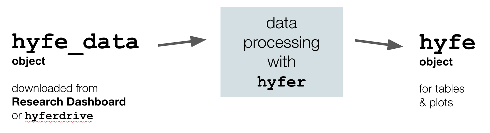

```{r, include = FALSE}
knitr::opts_chunk$set(
  collapse = TRUE,
  comment = "#>"
)
```

&nbsp;  

The `hyfer` package provides utilities for interacting with data collected by Hyfe cough detection apps ([www.hyfe.ai](www.hyfe.ai)). This package was designed to be used by Hyfe analysts and external research partners alike.   


## `hyfer` in a nutshell 

Put simply, `hyfer` processes raw Hyfe data -- which you downloaded in a standard format referred to as a **`hyfe_data`** object -- into a polished format for tables and plots. We refer to that post-processed, analysis-ready data as a **`hyfe`** object.  

&nbsp;  
<center>
{width=70%}
</center>
&nbsp;  

The following chunk of code shows you the whole game; use it as a template for starting your own analysis. The rest of the vignette explains each bit of this code, demonstrates other `hyfer` functions, and provides plot examples. 

```{r, echo=TRUE, eval=FALSE, include=TRUE, collapse=TRUE, warning=FALSE, message=FALSE}
# Install hyfer
library(devtools) 
devtools::install_github('hyfe-ai/hyfer', quiet=TRUE)
library(hyfer)

# Other dependencies
library(dplyr)
library(lubridate)
library(ggplot2)

# Bring in your hyfe_data object (here we use sample data)
data(hyfe_data)

# Process data for all users together
ho <- process_hyfe_data(hyfe_data)

# ... or process users separately
ho_by_user <- process_hyfe_data(hyfe_data, by_user = TRUE)

# summarize data
hyfe_summarize(ho_by_user)

# Now ready for plotting, etc. 
```


## Setup

### Install `hyfer`

```{r, echo=FALSE, eval=FALSE, include=FALSE, collapse=TRUE, warning=FALSE, message=FALSE}
# optional code for local fast load -- not included in vignette
library(dplyr)
library(devtools) 
document() 
load_all()
```

The `hyfer` package is maintained on `GitHub` and can be installed as follows: 

```{r, echo=TRUE, eval=TRUE, collapse=TRUE, warning=FALSE, message=FALSE}
library(devtools) 
devtools::install_github('hyfe-ai/hyfer', quiet=TRUE)
library(hyfer)
```

Hyfe data have been formatted for use with the `tidyverse` of packages, particularly `dplyr`, `lubridate`, and `ggplot2`. 

```{r, echo=TRUE, eval=TRUE, collapse=TRUE, warning=FALSE, message=FALSE}
library(dplyr)
library(lubridate)
library(ggplot2)
```

### Getting Hyfe data 

This package assumes (1) you already have some Hyfe data locally on your computer, and (2) those data are structured in a standardized way, as a **`hyfe_data` object** *(see next section)*.  

Hyfe's research collaborators can download data for their respective research cohorts from the [Hyfe Research Dashboard](https://dashboard.hyfe.ai/). Hyfe's internal analysts download data directly using `hyferdrive`, a private company package.  

Both the dashboard and `hyferdrive` deliver data structured in exactly the same way, allowing both groups to utilize the functions offered in `hyfer`.  

To get started in `hyfer`, begin by using a sample dataset that comes built-in to the package:  

```{r, echo=TRUE, eval=TRUE, collapse=TRUE, warning=FALSE, message=FALSE}
data(hyfe_data)
```

This sample dataset contains Hyfe data for two "super-users" of the [Hyfe Cough Tracker app](https://www.hyfeapp.com/).  


## Structure of `hyfe_data` 

All downloaded Hyfe data are provided in a standardized data format: a `hyfe_data` object. A `hyfe_data` object is simply a list with 6 standard slots. 

```{r, echo=TRUE, eval=TRUE, collapse=TRUE, warning=FALSE, message=FALSE}
names(hyfe_data)
```

A detailed description of each slot is provided below.  


#### `hyfe_data$id_key`  

The `id_key` slot provides the unique identifiers for each user represented in the data.  

```{r, echo=TRUE, eval=TRUE, collapse=TRUE, warning=FALSE, message=FALSE}
hyfe_data$id_key %>% head()
```

```{r, echo=FALSE, eval=FALSE, collapse=TRUE, warning=FALSE, message=FALSE}
Most researchers interact with identifiers in the `email` and `alias` columns, but the most important column in this dataframe is the `uid`. The `uid` is the key index for attaching Hyfe data to a specific user. Every other data slot in the `hyfe_data` object has a `uid` column.  
```


#### `hyfe_data$sessions`  

The `sessions` slot provides details for each session of user activity for all users in the data.  

```{r, echo=TRUE, eval=TRUE, collapse=TRUE, warning=FALSE, message=FALSE}
hyfe_data$sessions %>% names()

hyfe_data$sessions %>% head()
```

The `start` and `stop` times of each session of user activity are provided as numeric timestamps, as are all other date/time fields in the `hyfe_data` object. Though they are not easy to read, timestamps are an unambiguous and timezone-agnostic representation of date/time. Timestamps represent the seconds since midnight UTC on January 1, 1970. 


#### `hyfe_data$sounds`  

The `sounds` slot provides details for each explosive sound detected for all users in the data.  

```{r, echo=TRUE, eval=TRUE, collapse=TRUE, warning=FALSE, message=FALSE}
hyfe_data$sounds %>% names()

hyfe_data$sounds %>% head()
```

- The column `prediction_score` contains the probability that the explosive sound is a cough, based upon Hyfe's cough classification algorithms.   

- The column `is_cough` is a boolean (`TRUE` / `FALSE`) stating whether or not the prediction score is above Hyfe's cough prediction threshold of 0.85.  

- The column `onboarding_cough` is a boolean stating whether or not this sound was collected while the user was onboarding (following instructions upon log in to cough into the app). Since these are elicited coughs, in certain analyses it may be useful to ignore coughs for which `onboarding_cough == TRUE`.  


#### `hyfe_data$locations`  

The `locations` slot provides details for each location fix for all users in the data. 

```{r, echo=TRUE, eval=TRUE, collapse=TRUE, warning=FALSE, message=FALSE}
hyfe_data$locations %>% names()

hyfe_data$locations %>% head()
```

Note that some studies, such as the one related to this sample data, have location data service disabled.  

#### `hyfe_data$labels`  

This slot is empty for now. It is a placeholder for a future time in which hyfe will have  manually labelled sounds from a dataset associated with it inside the `hyfe_data` object. 

#### `hyfe_data$cohort_settings`  

```{r, echo=TRUE, eval=TRUE, collapse=TRUE, warning=FALSE, message=FALSE}
hyfe_data$cohort_settings %>% names()

hyfe_data$cohort_settings
```

The `cohort_settings` slot will only be populated if the `hyfe_data` object is for a research cohort. Otherwise this slot will be `NULL`.  Critically, `cohort_settings` contains the timezone used to determine local time in the function `format_hyfe_time()`.  


## Processing Hyfe data

Once you download Hyfe data, the first step is to process it.  

```{r, echo=TRUE, eval=TRUE, collapse=TRUE, warning=FALSE, message=FALSE}
ho <- process_hyfe_data(hyfe_data,
                        verbose=TRUE)
```

This returns a standard `hyfe` object (`ho` for short variable names), a named list with the original `hyfe_data` slots plus new ones. These `hyfe` objects are formatted to make subsequent plots and analyses as simple as possible.  The standard `hyfe` object structure is explored in detail in the next session.  

By default, the `process_hyfe_data()` function lumps all user data together before summarizing, even if multiple users are present. To summarize each user separately, use the input `by_user`:  

```{r, echo=TRUE, eval=TRUE, collapse=TRUE, warning=FALSE, message=FALSE}
ho_by_user <- process_hyfe_data(hyfe_data,
                        by_user = TRUE,
                        verbose=TRUE)
```


### Structure of a `hyfe` object  

Once a `hyfe_data` object is processed, it becomes a `hyfe` object. The structure and formatting of the `hyfe` object is designed to accommodate plotting and analysis.  

```{r, echo=TRUE, eval=TRUE, collapse=TRUE, warning=FALSE, message=FALSE}
ho %>% names
```

The first several slots contain the raw data from the `hyfe_data` object, and those data are unchanged.  

The `coughs` slot has all explosive sounds classified as a cough, with various new date/time variables to streamline plotting and analysis.   

```{r, echo=TRUE, eval=TRUE, collapse=TRUE, warning=FALSE, message=FALSE}
ho$coughs %>% head
```

The `hours`, `days`, and `weeks` slots hold summary timetables of session activity, peak/cough detections, and cough rates for the entire dataset.  

```{r, echo=TRUE, eval=TRUE, collapse=TRUE, warning=FALSE, message=FALSE}
ho$hours %>% head
```

```{r, echo=TRUE, eval=TRUE, collapse=TRUE, warning=FALSE, message=FALSE}
ho$days %>% as.data.frame %>% head
```

```{r, echo=TRUE, eval=TRUE, collapse=TRUE, warning=FALSE, message=FALSE}
ho$weeks %>% as.data.frame %>% head
```

Note that when processed with `by_user = TRUE`, the slot names are slightly different:  

```{r, echo=TRUE, eval=TRUE, collapse=TRUE, warning=FALSE, message=FALSE}
ho_by_user %>% names
```

The `user_summaries` slot is itself a list; each of its slots pertains to a single user. Each user has a list of 4 tables: `hours`, `days`, `weeks`, and `id_key`.  

```{r, echo=TRUE, eval=TRUE, collapse=TRUE, warning=FALSE, message=FALSE}
# Data structure for first user 
ho_by_user$user_summaries[[1]] %>% names
```

## Summarize Hyfe data  

To get summary metrics for a `hyfe` object, use the function `hyfe_summarize()`:  

```{r, echo=TRUE, eval=TRUE, collapse=TRUE, warning=FALSE, message=FALSE}
hyfe_summarize(ho)
```

Since the `ho` object was processed by aggregating all users together (note that the `users` slot in the output is `NULL`), the cough rates reported should be treated with caution: these rates are going to be biased by users with (1) a lot of monitoring time and (2) a lot of coughs.  

To summarize Hyfe data from multiple users in a way that is truly balanced, in which each user is weighted equally, you should use a `hyfe` object processed with `by_user = TRUE`:  

```{r, echo=TRUE, eval=TRUE, collapse=TRUE, warning=FALSE, message=FALSE}
hyfe_summarize(ho_by_user)
```

In the `users` slot of the output, you now you have a row summarizing each user. That user table is then used to build the `overall` slot.  The mean rates (i.e., `hourly_rate` and `daily_rate`) are the average of each user's mean rates, and -- importantly -- the variability metrics (`hourly_var`, `hourly_sd`, `daily_var`, `daily_sd`) now pertain to the variability *among* users.   

The `hyfe_summarize()` function uses sample size cutoffs to ensure that rates are no swung to extremes due to insufficient monitoring For example, an hour of day with 1 cough detection but only 1 minute of monitoring would produce an hourly cough rate estimate of 60 coughs per hour, when in fact that is simply not enough time to approximate cough rate.  The default cutoffs are: at least 30 minutes of monitoring must occur within a hour-long window of the day in order for that hour to contribute to the estimation of the hourly cough rate; and at least 4 hours of monitoring must occur within a day in order for that day to count toward the daily cough rate.  

You may adjust those defaults using the function arguments. For example, here is a much more stringent set of requirements, which may improve the accuracy of rate estimates but severely reduces sample size: 

```{r, echo=TRUE, eval=TRUE, collapse=TRUE, warning=FALSE, message=FALSE}
hyfe_summarize(ho_by_user,
               cutoff_hourly = 59,
               cutoff_daily = 23.9)
```

Note that the cumulative counts are unaffected by these cutoffs, only the rates.  


## Visualizing Hyfe data  

Custom plotting functions are under construction. For now, `ggplot` works well with `hyfe` objects (see examples in Overview above.)

### Cumulative plots  

For multiple users or cohorts;  

```{r, echo=TRUE, eval=TRUE, collapse=TRUE, warning=FALSE, message=FALSE, fig.width=6.5}
ggplot(ho$hours,aes(x=date, y=session_days_tot)) + geom_line() +
  labs(title='Cumulative person-days of monitoring') + ylab('Person-days') 
```

```{r, echo=TRUE, eval=TRUE, collapse=TRUE, warning=FALSE, message=FALSE, fig.width=6.5}
ggplot(ho$hours,aes(x=date, y=coughs_tot)) + geom_line() +
  labs(title='Cumulative cough detections') + ylab('Cough detections') 
```

For individual users:

```{r, echo=TRUE, eval=TRUE, collapse=TRUE, warning=FALSE, message=FALSE, fig.width=6.5}
ho1 <- ho_by_user$user_summaries[[2]]
```

```{r, echo=TRUE, eval=TRUE, collapse=TRUE, warning=FALSE, message=FALSE, fig.width=6.5}
ggplot(ho1$hours,aes(x=date, y=coughs_tot)) + geom_line() +
  labs(title='Cumulative cough detections') + ylab('Cough detections') 
```

### Time series  

```{r, echo=TRUE, eval=TRUE, collapse=TRUE, warning=FALSE, message=FALSE, fig.width=6.5}
ggplot(ho$days,aes(x=date, y=coughs)) + geom_col() + 
  labs(title='Daily time series of coughs (all users)') + ylab('Cough detections') 
```

```{r, echo=TRUE, eval=TRUE, collapse=TRUE, warning=FALSE, message=FALSE, fig.width=6.5}
ggplot(ho1$days,aes(x=date, y=coughs)) + geom_col() + 
  labs(title='Daily time series of coughs for user X') + ylab('Cough detections') 
```

```{r, echo=TRUE, eval=TRUE, collapse=TRUE, warning=FALSE, message=FALSE, fig.width=6.5}
ggplot(ho1$hours,aes(x=study_hour, y=cough_rate)) + geom_point(alpha=.3) +
  labs(title='Hourly cough rate in user X') + ylab('Cough detections per hour')  
```

### Circadian patterns 

```{r, echo=TRUE, eval=TRUE, collapse=TRUE, warning=FALSE, message=FALSE, fig.width=6.5}
ggplot(ho1$hours,aes(x=hour,y=cough_rate)) + geom_jitter(width=.3, alpha=.3) +
  scale_x_continuous(breaks=0:23) + 
  labs(title='Circadian pattern of cough in user X') + ylab('Cough detections per hour') 
```

### Cough distributions   

```{r, echo=TRUE, eval=TRUE, collapse=TRUE, warning=FALSE, message=FALSE, fig.width=6.5}
ggplot(ho1$hours,aes(x=cough_rate)) + geom_histogram() + 
  labs(title='Hourly distribution of cough rate, user X') + xlab('Cough detections per hour') 
```


## Background functions in `hyfer` 

The function `process_hyfe_data` relies on several background functions to do its thing. Those functions can also be called directly if you have need for them:  

#### `format_hyfe_time()`  

This function takes a set of timestamps and creates a dataframe of various date/time variables that will be useful in subsequent `hyfer` functions.  

```{r, echo=TRUE, eval=TRUE, collapse=TRUE, warning=FALSE, message=FALSE}
format_hyfe_time(c(1626851363, 1626951363))
```

When a timezone is not provided, as above, the function assumes that times are in `UTC`. You can specify that explicitly if you wish:  

```{r, echo=TRUE, eval=TRUE, collapse=TRUE, warning=FALSE, message=FALSE}
format_hyfe_time(c(1626851363, 1626951363), 'UTC')
```

This function is able to accept any timezone listed in the `R`'s built-in collection of timezones (see `OrsonNames()`).  

```{r, echo=TRUE, eval=TRUE, collapse=TRUE, warning=FALSE, message=FALSE}
format_hyfe_time(c(1626851363, 1626951363), 'Africa/Kampala')
```

```{r, echo=TRUE, eval=TRUE, collapse=TRUE, warning=FALSE, message=FALSE}
format_hyfe_time(c(1626851363, 1626951363), 'America/Chicago')
```


#### `expand_sessions()`

Most analyses of Hyfe data hinge upon detailed knowledge of when Hyfe was actively listening for coughs, and when it wasn't. To determine the duration of monitoring on an hourly or daily basis, use the `expand_sessions()` function.  

This function returns a list with two slots: `timetable` and `series`.  By default, `series` is returned as a `NULL` object since it is usually only needed for troubleshooting and can be time-consuming to prepare. The `timetable` is a dataframe in which monitoring activity is detailed for each individual user in the dataset on an hourly or daily basis.  

To create an **hourly time table:**  

```{r, echo=TRUE, eval=TRUE, collapse=TRUE, warning=FALSE, message=FALSE}
hyfe_time <- expand_sessions(hyfe_data, 
                             unit='hour',
                             verbose=TRUE)

hyfe_time$timetable %>% nrow

hyfe_time$timetable %>% head
```

You can then, for example, summarize session activity for the two users in the sample dataset:  

```{r, echo=TRUE, eval=TRUE, collapse=TRUE, warning=FALSE, message=FALSE}
hyfe_time$timetable %>% 
  group_by(uid) %>% 
  summarize(hours_monitored = sum(session_time) / 3600,
            days_monitored = sum(session_time) / 86400)
```

To create a **daily time table:**  

```{r, echo=TRUE, eval=TRUE, collapse=TRUE, warning=FALSE, message=FALSE}
hyfe_time <- expand_sessions(hyfe_data, 
                             unit='day')

hyfe_time$timetable %>% 
  group_by(uid) %>% 
  summarize(hours_monitored = sum(session_time) / 3600,
            days_monitored = sum(session_time) / 86400)
```

Instead of a summary of session activity, the `series` slot contains a continuous **second-by-second time series**:  

```{r, echo=TRUE, eval=TRUE, collapse=TRUE, warning=FALSE, message=FALSE}
hyfe_time <- expand_sessions(hyfe_data,
                             create_table = FALSE,
                             create_series = TRUE,
                             inactive_value = 0)
```

In this time series, every row is a second between the `floor_date` and `ceiling_date` of the study, and every column is a user (`uid`).  Seconds in which the user is active is represented with a "`1`". Inactive seconds are given the value of the input `inactive_value`, the default for which is "`0`". 

```{r, echo=TRUE, eval=TRUE, collapse=TRUE, warning=FALSE, message=FALSE}
hyfe_time$series %>% head
```

Confirm that the same total monitoring duration, in days, was found using the `series` approach.  

```{r, echo=TRUE, eval=TRUE, collapse=TRUE, warning=FALSE, message=FALSE}
hyfe_time$series %>% select(2,3) %>% apply(2,sum) / 86400
```

Note that this `series` feature is only useful in certain circumstances, and it can create enormous objects that slow everything down. However, it can be particularly valuable during troubleshooting if a phone seems to be acting up. 

**Tip:** Changing the inactive `inactive_value` to `NA` may make it easier to plot session activity as lines on plots.

```{r, echo=TRUE, eval=TRUE, collapse=TRUE, warning=FALSE, message=FALSE, fig.width=6.5}
hyfe_time <- expand_sessions(hyfe_data,
                             create_table = FALSE,
                             create_series = TRUE,
                             inactive_value = NA)

# Setup plot
par(mar=c(4.2,4.2,.5,.5))
plot(1, type='n', 
     xlim=range(hyfe_time$series$timestamp), 
     ylim=c(0,3),
     xlab='Timestamp',
     ylab='User')

# Add user 1
lines(x = hyfe_time$series$timestamp,
      y = hyfe_time$series[,2])

# Add user 2
lines(x = hyfe_time$series$timestamp,
      y = hyfe_time$series[,3] + 1)
```


#### `hyfe_timetables()`  

To create hourly/daily/weekly summaries of session activity, peak/cough detections, and cough rates, use the function `hyfe_summary_tables()`.  

```{r, echo=TRUE, eval=TRUE, collapse=TRUE, warning=FALSE, message=FALSE}
hyfe_tables <- hyfe_timetables(hyfe_data,
                               verbose=TRUE)
```

This function is essentially a wrapper for `expand_sessions()`, and calls both that function and `format_hyfe_time()`.  *Note: This function lumps all users together.*

This function returns a named list:  

```{r, echo=TRUE, eval=TRUE, collapse=TRUE, warning=FALSE, message=FALSE}
names(hyfe_tables)
```

**Hourly summary table:**  

```{r, echo=TRUE, eval=TRUE, collapse=TRUE, warning=FALSE, message=FALSE}
hyfe_tables$hours %>% as.data.frame %>% head
```

**Daily summary table**

```{r, echo=TRUE, eval=TRUE, collapse=TRUE, warning=FALSE, message=FALSE}
hyfe_tables$days %>% as.data.frame %>% head
```

**Weekly summary table:**

```{r, echo=TRUE, eval=TRUE, collapse=TRUE, warning=FALSE, message=FALSE}
hyfe_tables$weeks %>% as.data.frame %>% head
```


## Upcoming improvements

- Custom plotting functions  

- `synchronize_hyfe_times()`  for synchronizing Hyfe data to a set of labels. 

- Much, much more!  


